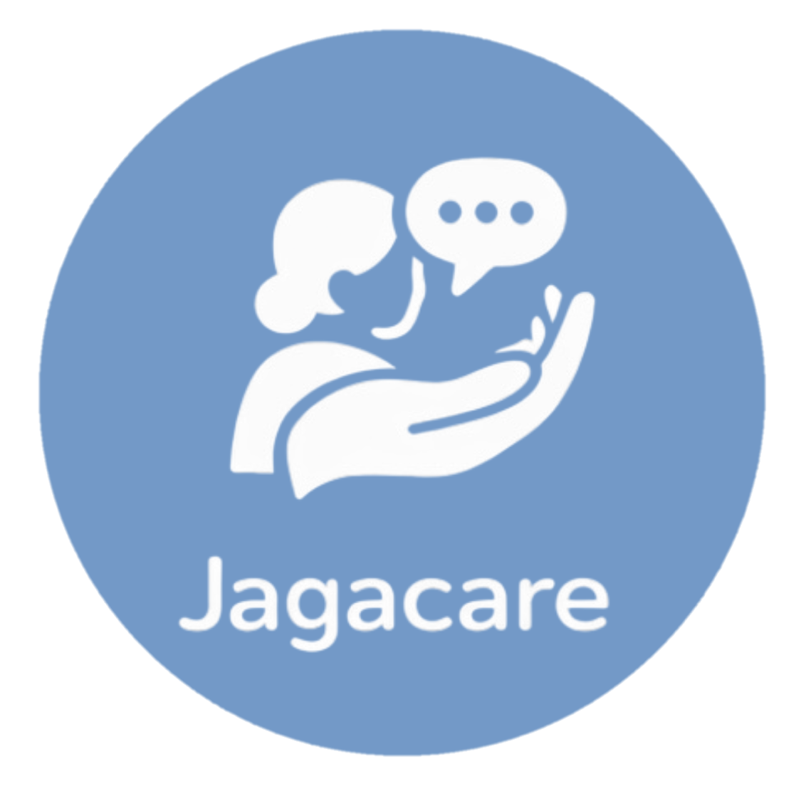
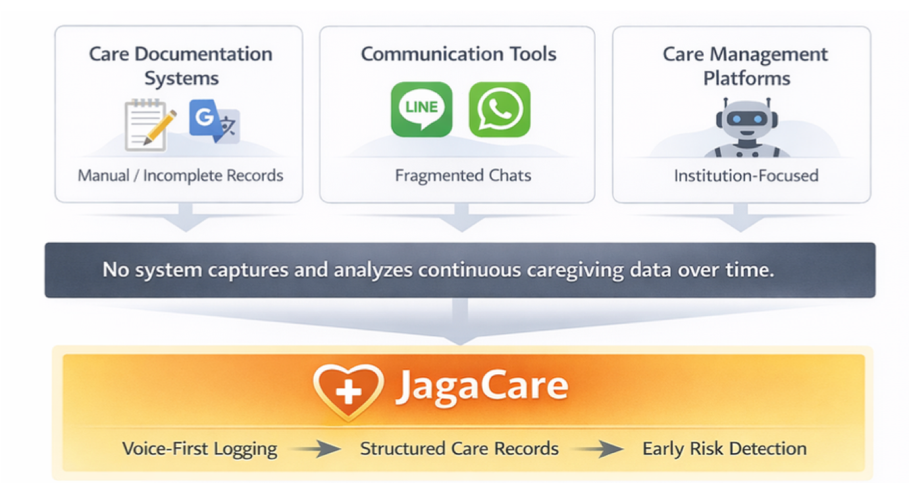

<div align="center">
  

  <h1>JagaCare</h1>

  <p>
    AI caregiving assistant and dashboard prototype for home based elder care.
  </p>

  <p>
    Turning multilingual caregiver speech into structured care records, family updates, and early risk signals.
  </p>
</div>

## Overview

JagaCare is an AI caregiving assistant concept for home based elder care. The goal is to make daily care more transparent, timely, and safer for families, older adults, and caregivers.

In Taiwan, home care often involves multilingual communication. Older adults may speak Taiwanese Hokkien, while caregivers may be more comfortable using Indonesian, Mandarin, Tagalog, or another language. This communication gap can make it difficult for families to understand what happened during the day and to notice care risks early.

JagaCare aims to turn spoken care updates into structured records. The system can help families review daily care activities and detect possible problems earlier, such as missed repositioning, reduced food intake, abnormal mood changes, or lower activity levels.

This repository currently contains the UI prototypes only. The backend AI pipeline described below is a planned technical direction, not a fully implemented production system yet.

## 中文說明

JagaCare 是一個用於居家長照的 AI 照護助理概念原型，目標是讓照護過程更透明、更即時，也更安全。

在台灣的居家照護場景中，長者可能習慣說台語，照護者可能更熟悉印尼語、中文、Tagalog 或其他語言。這種語言與資訊落差，會讓家屬比較難即時知道每天的照護狀況，也比較難提早發現潛在風險。

JagaCare 希望把口語照護紀錄轉成結構化資訊，協助家屬理解每天發生的照護事件，並更早注意到可能的問題，例如翻身不足、進食變少、情緒改變或活動量下降。

目前此 repository 主要包含 UI prototypes。下方提到的 backend AI pipeline 是未來可能採用的技術方向，尚未是完整的 production system。

## System Flow

The current care ecosystem is fragmented. Documentation systems are often manual or incomplete, communication happens across scattered chat tools, and care management platforms are usually institution focused.

JagaCare proposes a voice first care logging flow that converts caregiver updates into structured care records and early risk detection.

<div align="center">
  
</div>

## Demo

The current repository includes two UI prototypes.

| Prototype | Description | Demo |
| :-- | :-- | :-- |
| JagaBot | A caregiver facing assistant UI for voice first care logging and follow up interaction. | [Watch JagaBot demo](./assets/video/jagabot-demo.mp4) |
| JagaBoard | A family or care manager facing dashboard UI for reviewing structured care records and risk signals. | [Watch JagaBoard demo](./assets/video/jagaboard-demo.mp4) |

## Current Repository Status

This project currently includes:

| Part | Status |
| :-- | :-- |
| JagaBot UI | Prototype completed |
| JagaBoard UI | Prototype completed |
| Demo videos | Included |
| Logo and flowchart | Included |
| Backend ASR pipeline | Planned |
| Translation pipeline | Planned |
| AI agent memory | Planned |
| Risk detection logic | Planned |
| Real data integration | Not implemented yet |

## Planned Backend Direction

The backend direction is to combine speech recognition, multilingual translation, information extraction, and an AI agent with memory.

A possible pipeline:

```txt
Caregiver speech
    ↓
Speech recognition
    ↓
Language normalization and translation
    ↓
Structured care record extraction
    ↓
AI agent with memory
    ↓
Daily summaries, follow up questions, and risk alerts
    ↓
JagaBoard dashboard
```

Potential technologies and resources:

| Component | Possible Technique |
| :-- | :-- |
| Taiwanese Hokkien speech data | TaigiSpeech Dataset |
| Multilingual Taiwan ASR | Taiwan Tongues ASR CE |
| Taiwanese Hokkien language understanding | SARC Taigi LLM |
| Translation and summarization | ChatGPT or other LLMs |
| Indonesian communication support | ChatGPT based translation or dedicated translation model |
| Agent behavior | Memory, follow up questions, structured logging, risk pattern detection |

## Possible Language Flow

Initial target direction:

```txt
Taiwanese Hokkien speech
    ↓
ASR transcript
    ↓
Mandarin canonical care text
    ↓
Structured care record
    ↓
Indonesian or Mandarin family and caregiver summary
```

Possible extension:

```txt
Tagalog
    ↓
Taiwanese Hokkien or Mandarin
    ↓
Structured care record
    ↓
Family dashboard summary
```

## Why This Is Not Just a Translation Tool

JagaCare is not only translating caregiver speech.

The goal is to build a shared care coordination system. The system should help capture care events, organize them into structured records, remember previous context, ask follow up questions, summarize daily care, and alert families when repeated patterns may become risky.

In short, JagaCare aims to become an AI shared care operating system for aging at home.

## Example Risk Signals

Potential risk signals the system may track in the future:

| Risk Area | Example Signal |
| :-- | :-- |
| Repositioning | No repositioning record for a long period |
| Nutrition | Reduced meal or water intake |
| Mood | Repeated low mood or unusual behavior |
| Activity | Lower movement or fewer daily activities |
| Medication | Missed or unclear medication record |
| Communication | Important care update not confirmed by family |

## Apps

### JagaBot

JagaBot is the caregiver facing assistant interface. It is designed for quick daily logging, voice based care updates, and AI assisted follow up.

Potential future functions:

```txt
* Voice care logging
* Follow up questions
* Care event extraction
* Multilingual communication
* Daily summary generation
```

### JagaBoard

JagaBoard is the family or care manager facing dashboard. It is designed to make care records easier to review and to surface early risk signals.

Potential future functions:

```txt
* Structured care timeline
* Daily care summary
* Risk alerts
* Caregiver activity overview
* Family communication view
```

## Tech Stack

Current UI:

```txt
Frontend prototype (Javascript)
```

Planned backend:

```txt
* ASR
* LLM based translation
* Information extraction
* Agent memory
* Risk detection
* Dashboard integration
```

## Project Structure

```txt
jagacare/
  assets/
    logo/
      jagacare-logo.png
    diagrams/
      flowchart.png
    videos/
      jagabot-demo.mp4
      jagaboard-demo.mp4
  apps/
    jagabot/
    jagaboard/
  README.md
```

## Run Locally

This repository currently contains frontend UI prototypes exported from Figma Make.

To run one app locally, go into the app folder and install dependencies:

```bash
cd apps/jagabot
npm install
npm run dev
```

Or for the dashboard:

```bash
cd apps/jagaboard
npm install
npm run dev
```

The exact command may depend on the package scripts generated by Figma Make. Check each app's `package.json` if `npm run dev` does not work.

## References and Potential Backend Resources

* [TaigiSpeech Dataset](https://huggingface.co/datasets/TaigiSpeech/TaigiSpeech)

* [Taiwan Tongues ASR CE](https://github.com/adi-gov-tw/Taiwan-Tongues-ASR-CE)

* [IMA Taiwan Tongues Taigi Dataset](https://huggingface.co/IMA-Taiwan)

* [SARC Taigi LLM Demo](https://llm.ivoice.tw:64441/)

* [SARC Taigi LLM - Speech AI Research Center (Hugging Face)](https://huggingface.co/Speech-AI-Research-Center)

* [Speech AI Research Center (GitHub)](https://github.com/Speech-AI-Research-Center)

## Disclaimer

JagaCare is currently a prototype and research concept. It is not a medical device and should not be used for clinical decision making without proper validation, safety review, privacy design and human supervision.
